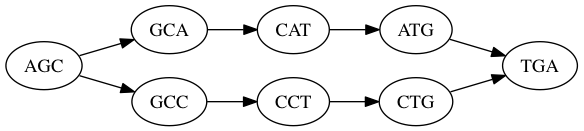
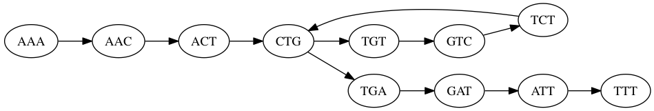

## Genome Sequence Assembly

| Shaun Jackman
| [\@sjackman][] | [github.com/sjackman][] | [sjackman.ca][]

| [BC Cancer Agency Genome Sciences Centre][]
| Vancouver, Canada

| [][cc-by]
| [Slides on GitHub][]

With many thanks to Rayan Chikhi for sharing [his slides](http://evomicsorg.wpengine.netdna-cdn.com/wp-content/uploads/2016/01/Assembly-2016-v2.1.pdf)

[\@sjackman]: http://twitter.com/sjackman
[github.com/sjackman]: https://github.com/sjackman
[sjackman.ca]: http://sjackman.ca
[BC Cancer Agency Genome Sciences Centre]: http://bcgsc.ca
[cc-by]: http://creativecommons.org/licenses/by/4.0/
[Slides on GitHub]: https://github.com/sjackman/assembly-slides

# What, Why, How

## What are you assembling?

+ Who already has data to assemble?
+ Who plan to sequence a species without a reference?
+ DNA? RNA?
+ Illumina? PacBio? Other?
+ 10x Genomics? BioNano? Fosmid / BAC?

## Why

+ Reference genome / transcriptome
+ Gene content
+ Novel sequence, un-mapped reads
+ SNPs in non-model organisms
+ Structural variants
+ Metagenomics
+ and more!

## What and How are determined by Why

## Scenario 1

**Why**

: Comparative analyses, like gene synteny

**What**

: A complete genome

**How**

: High-coverage PacBio data

## Scenario 2

**Why**

: Gene content and SNPs

**What**

: Draft quality assembly

**How**

: A couple of Illumina libraries

## Assembly: A solved problem?

## Still a difficult problem in 2016

+ High computational requirements
+ Long read methods are rapidly improving but still new
+ Hard to obtain good assemblies from Illumina data
+ Collapsed repeats and coverage gaps result in poor sequence contiguity

Conclusion of the GAGE benchmark:

> In terms of assembly quality, there is no single best assembler.

## Current research

+ Assemblers for particular data types
    + PacBio
    + Nanopore
    + 10x Genomics
+ Efficient assemblers
+ Best-practice protocols
+ Assembly-based variant calling

# What is a de novo assembly

## Description

One definition of an assembly

(a trickier question than it seems)

### The true goal

> A set of sequences that approximates the original sequenced material.

### More pragmatically

> A set of sequences that explains the sequencing reads.

## An assembly...

+ is fragmented (discontiguous)
+ is missing sequence
+ mixes up alleles
+ collapses repeats (wrong at a small scale)
+ joins distant sequences (wrong at a large scale)

## Vocabulary

Read

: Any sequence that comes out of the sequencer

Paired-end library

: Two reads from a fragment less than 1000 bp

Mate-pair library

: Two reads from a fragment larger than 1000 bp

Long read

: A read longer than 1000 bp

----------------------------------------

*k*-mer

: A *k* bp subsequence of a read

Unitig

: Contigs before collapsing heterozygous variants

Contig

: An assembled sequence with no gaps

Scaffold

: An assembled sequence with gaps ("N"s)

Scaftig

: Contigs extracted from scaffolds

# Some useful assembly theory

## Graphs

A graph is composed of

+ A set of vertices and
+ A set of edges (directed or not)

Each edge connects two vertices

## Assembly graphs

To make good choices, an assembler needs to find all overlapping reads.

Two types of assembly graphs

+ de Bruijn graphs for accurate reads (Illumina)
+ overlap graphs for long reads (PacBio)

## Grokking assembly graphs

Someone who understands assembly graphs can intuit

+ how **nonuniform coverage** creates gaps
+ when **repeats** are collapsed
+ how **variant** sequence can be lost
+ how **variant** regions can appear twice
+ how **parameters** affect the assembly
+ the types of **errors** that assemblers make

## Overlap graph

+ Each vertex represents a read
+ Each edge joins two reads that overlap

### Traits

+ Lengths of reads and overlaps are variable
+ Overlaps may be imperfect: mismatches and indels

### Advantages

+ Represents overlaps between long, noisy reads
+ Uses the full length of the read

## De Bruijn graph

+ Each vertex represents a *k*-mer of fixed size
+ Each edge represents two *k*-mers that overlap perfectly by exactly *k*-1 bp

A de Bruijn graph is a special case of an overlap graph.

## De Bruijn graph

### Advantages

+ **Memory**: Size of each sequence and overlap are identical, so no need to store them in memory
+ **Performance**: Considers only perfect overlaps, no mismatches or indels
+ **Self-trimming**: Discards most bad *k*-mers

### Disadvantages

+ Does not make use of the full length of the read
+ Requires *k* perfect consecutive bases with no errors

## Example de Bruijn Graph

A single read and *k*=3

    ACTG

`ACT -> CTG`

Many reads and *k*=3

    ACTG
     CTGC
      TGCC

`ACT -> CTG -> TGC -> GCC`

## Duplicate reads

What happens if we add duplicate reads?

    ACTG
    ACTG
     CTGC
     CTGC
     CTGC
      TGCC
      TGCC

`ACT -> CTG -> TGC -> GCC`

+ Reduces memory usage in principle because sequencing saturates the genome
+ In practice error *k*-mers still accumulate linearly with the number of reads

## Errors cause tips

How does a sequencing error at the end of a read impact the de Bruijn graph?

ACTG
 &nbsp;CTGC
 &nbsp;CTG**A**
 &nbsp;&nbsp;TGCC

## SNVs cause bubbles

What is the effect of a single-nucleotide variant (SNV) on the graph?
(or a sequencing error in the middle of a read)

AGC**A**TGA 
AGC**C**TGA

AGC -> GC**A** -> C**A**T -> **A**TG -> TGA 
AGC -> GC**C** -> C**C**T -> **C**TG -> TGA

## Repeats cause cycles

What is the effect a small repeat on the graph?

AAA**CTG**T**CTG**ATTT 

AAA -> AAC -> ACT -> **CTG** -> TGT -> GTC -> TCT -> **CTG** -> TGA -> GAT -> ATT -> TTT

## So, which is better?

Typically

+ de Bruijn graph is used for short read assembly
+ overlap graph (OLC) is used for long read assembly

OLC: Overlap, Layout, Consensus

# How to evaluate an assembly

## Metrics

Comparing assemblies is not simple.

There's a trade off between

+ contiguity
+ completeness
+ correctness

## Assembly metrics

### Contiguity

+ N50/NG50 of contigs/scaffolds
+ Number of contigs/scaffolds

### Completeness

+ Assembled genome size
+ Number of core single-copy genes

### Correctness

+ Number of breakpoints, aligned to a reference genome
+ NGA50 of contigs/scaffolds

Tools: QUAST and BUSCO (CEGMA)

# fin

## Exercise

    TACAGT
      CAGTC
       AGTCA
          CAGA

1. How many *k*-mers are in these reads for *k*=3 (including duplicates)?

2. How many *distinct* *k*-mers are in these reads for *k*=3? *k*=5?

3. Given these reads come from the genome TACAGTCAGA, what is the largest
   *k* such that the set of *k*-mers in the genome is identical to
   the set of *k*-mers in the reads above?

## Solution

    TACAGT
      CAGTC
       AGTCA
          CAGA

1. How many *k*-mers are in these reads for *k*=3 (including duplicates)?
   **12**

2. How many *distinct* *k*-mers are in these reads?
    **7 for *k*=3, and 4 for *k*=5**

3. Given these reads come from the genome TACAGTCAGA, what is the largest
   *k* such that the set of *k*-mers in the genome is identical to
   the set of *k*-mers in the reads above?
    ***k*=3. For *k*=4, TCAG does not appear in the reads**

## Number of *k*-mers

per read of length *l* is

*l* − *k* + 1

(including duplicate *k*-mers)
